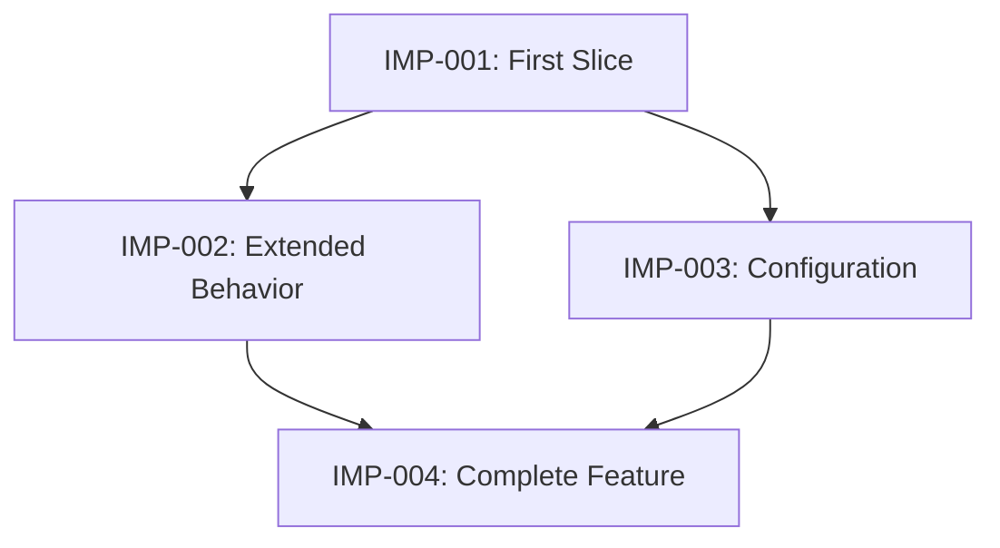

# Implementation Plan

## Purpose

Convert the approved requirements and architecture into small, ordered, and verifiable implementation issues that an agent can execute with limited additional context.

## Main Question

> In what small, verifiable increments should the mod be built?

## Required Input

- `mod-project-defaults.md`
- `concept-and-scope.md`
- `feasibility-research.md`
- `requirements.md`
- `architecture.md`

Read and follow all input documents before beginning this stage.

## Objectives

Establish:

- The implementation strategy
- Thin vertical slices of working behavior
- Dependencies and blocking relationships
- The order in which issues should be completed
- Which requirements each issue satisfies
- Which architectural components each issue affects
- How each issue will be verified
- Which technical risks should be addressed early
- What constitutes completion for each issue
- Which optional requirements are deferred

## In Scope

- Breaking requirements into implementation issues
- Organizing work into vertical slices
- Identifying necessary foundational work
- Defining issue dependencies
- Creating an acyclic dependency graph
- Prioritizing risky or uncertain work
- Defining acceptance criteria for each issue
- Defining verification procedures
- Linking issues to requirements and architecture
- Identifying likely code areas affected
- Establishing issue statuses and workflow
- Establishing a Definition of Done

## Out of Scope

Do not attempt to:

- Write production code
- Implement tests
- Redesign approved requirements or architecture
- Add unapproved features
- Resolve implementation discoveries that have not occurred
- Specify every method-level coding action
- Create release documentation or assets
- Plan maintenance after release
- Produce arbitrary time estimates or deadlines

If planning reveals a defect in the requirements or architecture, return the issue to the appropriate stage instead of silently compensating for it in the plan.

## Desired AI Behavior

Act as an implementation planner.

- Derive implementation issues from the approved requirements and architecture.
- Prefer small vertical slices that produce integrated, observable behavior.
- Create the smallest useful end-to-end slice early.
- Avoid organizing the entire plan into horizontal technical layers.
- Allow foundational issues only when they genuinely unblock vertical slices.
- Keep foundational work as small and specific as possible.
- Give every issue a clear objective and completion boundary.
- Make dependencies explicit.
- Ensure the dependency graph contains no cycles.
- Schedule high-risk assumptions and implementation validations early.
- Define verification before implementation begins.
- Select verification appropriate to the behavior instead of requiring strict TDD.
- Use automated tests for isolated logic where practical.
- Use Minecraft client, dedicated-server, multiplayer, compatibility, or performance verification where required.
- Ensure each issue is understandable to an agent starting with a fresh context.
- Avoid repeating entire project documents inside every issue.
- Reference requirements and architectural decisions by stable identifiers.
- Avoid speculative tasks for hypothetical future needs.
- Ask the project owner one focused question at a time when prioritization or scope decisions are required.
- Do not ask questions already answered by approved documents.
- Identify contradictions or missing information rather than guessing.
- Present the complete plan for approval before generating the final artifacts.

## Vertical Slices

A vertical slice should implement a small piece of behavior across every necessary part of the system.

For example, a slice might include:

- Relevant configuration
- Core behavior
- Forge integration
- Client/server handling
- Persistence or networking
- Verification

A vertical slice should produce something observable and verifiable, even if the feature is not yet complete.

Do not split work entirely into layers such as:

1. Create every data class.
2. Create every Forge event handler.
3. Create every network message.
4. Connect everything at the end.

Some horizontal or foundational work may still be necessary, including:

- Initial project configuration
- Shared registration infrastructure
- Test infrastructure
- Required dependency setup

Such work must have a concrete consumer and must not become speculative framework construction.

## Issue Size

An issue should:

- Have one coherent objective.
- Produce an observable result or unblock a specific slice.
- Be small enough for a focused implementation session.
- Be independently reviewable.
- Have explicit acceptance criteria.
- Have a defined verification procedure.
- Avoid combining unrelated requirements.

If an issue has multiple unrelated outcomes or an extensive verification procedure, split it.

## Issue Statuses

Use these statuses:

- **Backlog:** Identified but not ready to implement.
- **Ready:** Fully defined and all blockers are resolved.
- **In Progress:** Currently being implemented.
- **Review:** Implementation is complete and awaiting independent review.
- **Blocked:** Cannot proceed because a dependency or decision is unresolved.
- **Done:** Acceptance criteria, verification, and review are complete.
- **Deferred:** Intentionally excluded from the current release.

Only issues with the **Ready** status should be given to an implementation agent.

## Issue Format

Use stable identifiers such as `IMP-001`.

Each issue should follow this structure:

```markdown
# IMP-001: Short Issue Name

**Status:** Ready  
**Type:** Vertical Slice  
**Priority:** High  
**Blocked By:** None

## Objective

Describe the single outcome this issue must produce.

## Requirements

- REQ-001
- REQ-002

## Architecture References

- Relevant component
- ARC-001

## Expected Outcome

Describe the observable behavior available after completion.

## In Scope

- Work included in this issue

## Out of Scope

- Related work intentionally excluded from this issue

## Implementation Constraints

- Approved architectural boundaries
- Required libraries or integration points
- Client/server restrictions
- Relevant project defaults

## Likely Code Areas

- Packages, components, or resources likely to change

## Acceptance Criteria

- Given ..., when ..., then ...
- Given ..., when ..., then ...

## Verification

- Automated checks where practical
- Development-client checks
- Dedicated-server checks
- Multiplayer, compatibility, or performance checks when relevant

## Completion Evidence

Record the tests, commands, observations, logs, or measurements demonstrating completion.
```

Use `Type: Foundation` only when an issue does not directly deliver observable mod behavior but is necessary to unblock identified vertical slices.

## Dependency Graph

Represent blocking relationships as a directed acyclic graph.

An issue may begin only when all issues listed under `Blocked By` are complete.

Use a compact Mermaid diagram when it makes the dependencies easier to understand:



The graph describes dependency order, not necessarily a strict sequence. Issues without dependencies may be implemented independently.

## Definition of Done

An implementation issue is Done only when:

- Its implementation is complete.
- Its acceptance criteria are satisfied.
- Required automated checks pass.
- Required in-game verification is complete.
- Client and dedicated-server behavior have been checked when relevant.
- No unrelated requirements were introduced.
- The implementation follows the approved architecture.
- Relevant defects have been resolved or explicitly recorded.
- An independent review has been completed.
- Completion evidence has been recorded.
- The issue status has been changed to **Done**.

## Process

1. Read all required input documents.
2. Extract requirements, architectural components, and implementation risks.
3. Identify the smallest useful end-to-end behavior.
4. Define the first vertical slice.
5. Divide remaining behavior into additional vertical slices.
6. Add only the foundational issues required by identified slices.
7. Link every issue to requirements and architecture.
8. Define acceptance criteria and verification for every issue.
9. Identify dependencies and blockers.
10. Construct the dependency graph.
11. Check the graph for cycles.
12. Schedule risky assumptions and validation work early.
13. Confirm that every required behavior is covered.
14. Identify optional requirements that will be deferred.
15. Present the plan for project-owner approval.
16. After approval, generate the implementation-plan artifacts.

## Output Artifacts

### `implementation-plan.md`

Produce a Markdown document containing:

1. **Implementation Strategy**
2. **Vertical Slice Overview**
3. **Foundation Work**
4. **Issue Summary**
5. **Dependency Graph**
6. **Suggested Execution Order**
7. **Risk-Driven Priorities**
8. **Verification Strategy**
9. **Definition of Done**
10. **Requirement Traceability**
11. **Deferred Requirements**

### `issues/`

Create one Markdown file for each implementation issue:

```text
issues/
├── IMP-001-short-name.md
├── IMP-002-short-name.md
└── IMP-003-short-name.md
```

The implementation plan should reference these files instead of duplicating their full contents.

## Completion Criteria

This stage is complete when:

- Every MUST requirement is covered by at least one issue.
- Every SHOULD and MAY requirement is scheduled or explicitly deferred.
- Issues are organized primarily as vertical slices.
- Necessary foundational work has a specific identified consumer.
- Every issue has an objective, scope, acceptance criteria, and verification procedure.
- Every issue references relevant requirements and architecture.
- All blocking relationships are explicit.
- The dependency graph is acyclic.
- High-risk implementation validations are scheduled early.
- The first slice produces integrated and observable behavior.
- Each Ready issue can be understood by an agent with fresh context.
- The Definition of Done is established.
- The project owner explicitly approves the plan.
- `implementation-plan.md` and the issue files have been generated.

Completion does not require writing implementation code.

The plan is an approved baseline, but it may be updated when implementation produces new evidence. Any change affecting requirements or architecture must return to the appropriate earlier stage.